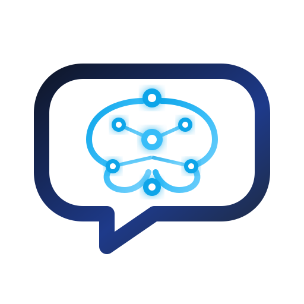

<div align="center">
  

  # **Interview Coach®**
  ### *Enterprise-Grade Adaptive AI Mock Interview Platform*

  [](https://nextjs.org/)
  [](https://www.typescriptlang.org/)
  [](https://supabase.com/)
  [](https://sass-lang.com/)
  [](LICENSE)

  ---
</div>

## 📌 Executive Overview

**Interview Coach®** is a high-performance, AI-driven technical and behavioral mock interview platform engineered for modern software engineers, architects, and tech practitioners. 

The platform features real-time dynamic difficulty scaling algorithms, Web Speech voice-to-text dictation with dynamic audio frequency equalizers, comprehensive STAR-method evaluation metrics, and granular analytics dashboards.

---

## ✨ Key Features & Capabilities

### 🎙️ 1. Real-Time Voice Dictation & Audio Waveform Engine
- **Voice-to-Text Speech Recognition**: Uses browser-native `Web Speech API` (`webkitSpeechRecognition`) for instant, continuous dictation. Spoken words automatically populate the answer workspace in real time.
- **Dynamic Call Capsule Widget**: Clicking the dictation microphone smoothly expands into an iOS-inspired Dynamic Island black call capsule.
- **Web Audio API Frequency Equalizer**: Uses `AudioContext` and `AnalyserNode` to sample microphone frequency spectra (`getByteFrequencyData`), driving line-by-line animated equalizer wave bars (`#22c55e`) synchronized to speech volume.
- **Instant Red Stop Button**: A dedicated crimson stop button (`#ef4444`) allowing candidates to pause voice capture instantly.

### 🎯 2. Adaptive Difficulty Scaling Engine
- Dynamically evaluates candidate response quality after every question using a weighted scoring matrix (0–100).
- Automatically adjusts question difficulty levels (**Easy** → **Medium** → **Hard**) in real time based on performance trajectories.

### 🧠 3. Tech Role Tracks & Structured Question Banks
- **Target Role Presets**: Dedicated practice tracks for **Frontend Engineer**, **Backend Engineer**, **Full-Stack Engineer**, **System Architect**, **DevOps Specialist**, and **Data Engineer**.
- **Domain Focus Areas**: Practice specialized modules across **Behavioral**, **System Design**, **Algorithms**, **Frontend Architecture**, and **DevOps Infrastructure**.
- **STAR Method Guidance**: Built-in key evaluation criteria panels offering structured hints for Situation, Task, Action, and Result framing.

### 📊 4. Performance Analytics & Score Tiering
- Comprehensive session summaries detailing average score, best performance, trend progression, and streak velocity.
- Tiered evaluation feedback broken down into strengths, growth areas, and actionable improvement recommendations.

---

## 🏗️ System Architecture

```
                               ┌──────────────────────────────────────────┐
                               │            Interview Coach®              │
                               │          Next.js 14 App Router           │
                               └────────────────────┬─────────────────────┘
                                                    │
                 ┌──────────────────────────────────┼──────────────────────────────────┐
                 │                                  │                                  │
                 ▼                                  ▼                                  ▼
     ┌───────────────────────┐          ┌───────────────────────┐          ┌───────────────────────┐
     │  Voice & Audio Engine │          │  Adaptive Scoring AI  │          │   Supabase Persistence│
     ├───────────────────────┤          ├───────────────────────┤          ├───────────────────────┤
     │ • Web Speech API      │          │ • STAR Evaluator      │          │ • interview_sessions  │
     │ • Web Audio API       │          │ • Difficulty Scaling  │          │ • interview_exchanges │
     │ • AnalyserNode FFT    │          │ • Scoring Tier Engine │          │ • User Profiles       │
     └───────────────────────┘          └───────────────────────┘          └───────────────────────┘
```

---

## 🛠️ Technology Stack

| Layer | Technology | Details |
| :--- | :--- | :--- |
| **Framework** | [Next.js 14](https://nextjs.org/) | App Router with React Server Components & Client Hooks |
| **Language** | [TypeScript](https://www.typescriptlang.org/) | Strict type definitions across models, API schemas, and props |
| **Styling** | [SCSS Modules](https://sass-lang.com/) | Custom design system using variables, mixins, and BEM structure |
| **Database & Auth** | [Supabase](https://supabase.com/) | Real-time PostgreSQL database with automated state hydration |
| **Voice Engine** | Web Speech API | `window.webkitSpeechRecognition` continuous speech recognition |
| **Audio Engine** | Web Audio API | `AudioContext` & `AnalyserNode` frequency spectrum visualizer |
| **Icons** | [Lucide React](https://lucide.dev/) | High-precision vector UI icons |

---

## 🚀 Getting Started (Local Development)

Follow these steps to run **Interview Coach®** locally on your machine:

### 📋 Prerequisites
Ensure you have the following installed on your system:
- **Node.js**: `v18.0.0` or higher
- **npm** or **yarn** / **pnpm**
- **Git**

---

### 1️⃣ Clone the Repository

```bash
git clone https://github.com/your-org/adaptive-ai-coach.git
cd adaptive-ai-coach
```

---

### 2️⃣ Install Dependencies

```bash
npm install
```

---

### 3️⃣ Setup Environment Variables

Create a `.env.local` file in the root directory and populate your Supabase API keys:

```env
NEXT_PUBLIC_SUPABASE_URL=https://your-supabase-project.supabase.co
NEXT_PUBLIC_SUPABASE_ANON_KEY=your-supabase-anon-key
```

---

### 4️⃣ Setup Database Schema (Supabase)

Run the following DDL script inside your **Supabase SQL Editor** to initialize required tables:

```sql
-- Create interview_sessions table
CREATE TABLE IF NOT EXISTS interview_sessions (
  id UUID PRIMARY KEY DEFAULT gen_random_uuid(),
  role TEXT NOT NULL,
  focus_area TEXT NOT NULL,
  difficulty TEXT NOT NULL,
  status TEXT DEFAULT 'in_progress',
  overall_score INT,
  started_at TIMESTAMPTZ DEFAULT NOW(),
  completed_at TIMESTAMPTZ
);

-- Create interview_exchanges table
CREATE TABLE IF NOT EXISTS interview_exchanges (
  id UUID PRIMARY KEY DEFAULT gen_random_uuid(),
  session_id UUID REFERENCES interview_sessions(id) ON DELETE CASCADE,
  question TEXT NOT NULL,
  question_tag TEXT NOT NULL,
  difficulty TEXT NOT NULL,
  answer TEXT,
  score INT,
  feedback TEXT,
  strengths TEXT,
  improvements TEXT,
  created_at TIMESTAMPTZ DEFAULT NOW()
);
```

---

### 5️⃣ Launch the Development Server

```bash
npm run dev
```

Open [http://localhost:3000](http://localhost:3000) in your browser to view the application.

---

## 📂 Project Structure

```
Adaptive-AI-Coach/
├── public/
│   └── logo.svg                 # SVG Brand Logo
├── src/
│   ├── app/                     # Next.js 14 App Router Pages
│   │   ├── analytics/           # Analytics Dashboard Page
│   │   ├── interview/           # Practice Workspace & Session Runner
│   │   ├── report/[id]/         # Session Evaluation Report Page
│   │   ├── roles/               # Role Tracks Page
│   │   ├── layout.tsx           # Global Root Layout
│   │   └── page.tsx             # Home Landing Page
│   ├── components/              # React UI Components
│   │   ├── AuthModal.tsx        # Authentication Drawer
│   │   ├── Dashboard.tsx        # Practice Dashboard & Sidebar
│   │   ├── HeaderNav.tsx        # Fixed Header Navigation Bar
│   │   ├── InterviewView.tsx    # Live Interview Engine & Dictation Capsule
│   │   └── LandingView.tsx      # Landing Hero & Feature Showcase
│   ├── lib/                     # Core Business Logic & Libraries
│   │   ├── questions.ts         # Question Bank & Selection Logic
│   │   ├── scoring.ts           # Adaptive Difficulty & STAR Scoring Algorithm
│   │   └── supabase.ts          # Supabase Client & TypeScript Types
│   └── styles/                  # Design System & SCSS Modules
│       ├── _variables.scss      # Theme Colors & Typography Tokens
│       ├── AppLayout.module.scss# Header & Layout SCSS
│       ├── Dashboard.module.scss# Dashboard & Sidebar SCSS
│       └── InterviewView.module.scss # Dictation & Capsule Animation SCSS
├── .env.example                 # Environment Template
├── next.config.mjs              # Next.js Configuration
├── package.json                 # Project Manifest & Dependencies
└── README.md                    # Platform Documentation
```

---

## 🛡️ License

Distributed under the MIT License. See `LICENSE` for more information.

---

<div align="center">
  <sub>Built with precision for software engineers worldwide by the <strong>Interview Coach® Team</strong>.</sub>
</div>
